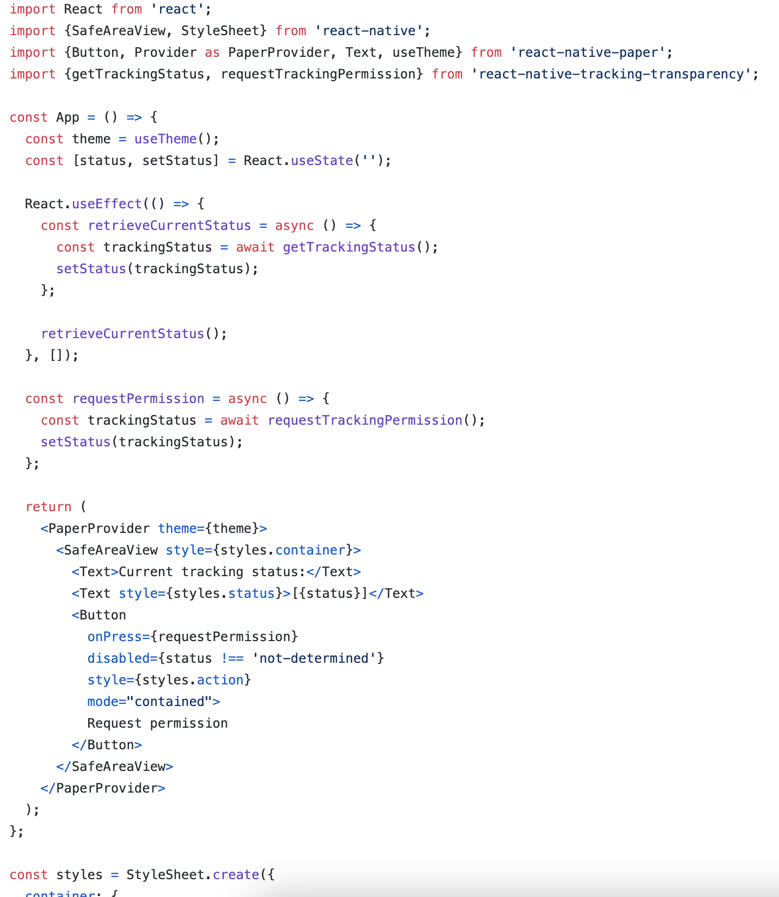
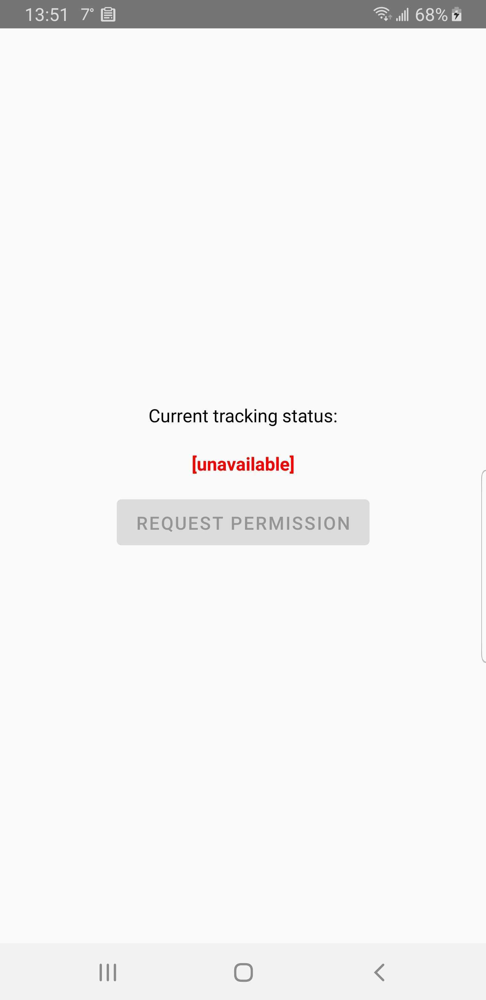
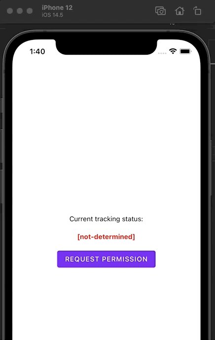
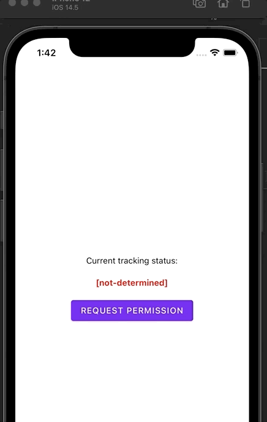

# POC ReactNative tracking-transparency

* npm [react-native-tracking-transparency](https://www.npmjs.com/package/react-native-tracking-transparency)
* Apple [App Tracking Transparency](https://developer.apple.com/documentation/apptrackingtransparency)

# Code sample

* see full code here: [App.tsx](./App.tsx)

  

# Demo screen capture for Android:

  

## Demo screen captures for iOS:

  
  

# Setup instructions

- `npm install`
- `pod install --project-directory=ios`

# Execution instructions

- `npx react-native start`
- `npx react-native run-android`
- `npx react-native run-ios`

